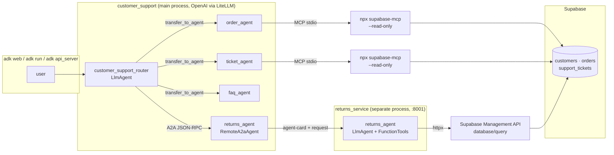

<div align="center">

# Multi-Agent Customer Support System

**Route, reason, resolve.** A **Google ADK** router delegates to **MCP-connected** specialists for orders and tickets, and hands returns off to a separate **A2A** service — all grounded in a live **Supabase** store.

[](https://www.python.org/)
[](https://google.github.io/adk-docs/)
[](https://google.github.io/adk-docs/a2a/)
[](https://supabase.com/docs/guides/getting-started/mcp)
[](https://docs.litellm.ai/)
[](https://openai.com/)
[](https://www.starlette.io/)
[](https://react.dev/)
[](https://www.typescriptlang.org/)
[](https://vitejs.dev/)
[](./LICENSE)

</div>

</div>

## At a glance

| | |
|:---|:---|
| **Router** | `customer_support_router` — `LlmAgent` that classifies intent and `transfer_to_agent` to exactly one specialist. |
| **Orders** | `order_agent` — order / shipping / tracking. **Read-only Supabase via MCP** (`npx @supabase/mcp-server-supabase`). |
| **Tickets** | `ticket_agent` — existing tickets + triage of new complaints. **Read-only Supabase via MCP**. |
| **Returns** | `returns_agent` — **`RemoteA2aAgent`** pointing at a standalone service that can **write** (refund ticket + flip `orders.status='returned'`). |
| **FAQ** | `faq_agent` — shipping / returns / warranty policy text. **No database**. |
| **Data** | Live Supabase project with `customers`, `orders`, `support_tickets` (15 rows each). |
| **Protocols** | **MCP** over stdio for read path; **A2A** over HTTP/JSON-RPC for the remote Returns specialist. |

---

## Feature highlights

```
┌──────────────────────────────────────────────────────────────────┐
  Routing      ·  ADK sub-agent transfers; multi-hop hand-offs
  Reads        ·  Supabase MCP in --read-only, tool surface filtered
  Writes       ·  Separate A2A service using Supabase Management API
  Safety       ·  Atomic CTE: INSERT ticket + UPDATE order in one SQL
  Idempotency  ·  check_return_eligibility refuses already-returned
  UI           ·  React + TS chat; live agent-transfer & tool-call trace
└──────────────────────────────────────────────────────────────────┘
```

---

## How it works



---

## Repository layout

| Path | Role |
|------|------|
| `Backend/customer_support/agent.py` | `root_agent` router (`LlmAgent`, `sub_agents=[...]`). |
| `Backend/customer_support/config.py` | Shared `LiteLlm` model factory (OpenAI). |
| `Backend/customer_support/tools/supabase_mcp.py` | Read-only `MCPToolset` factory shared by MCP specialists. |
| `Backend/customer_support/sub_agents/order_agent/` | Orders specialist (MCP). |
| `Backend/customer_support/sub_agents/ticket_agent/` | Tickets specialist (MCP). |
| `Backend/customer_support/sub_agents/faq_agent/` | Policy specialist (no DB). |
| `Backend/customer_support/sub_agents/returns_agent.py` | Thin `RemoteA2aAgent` proxy to the Returns service. |
| `Backend/returns_service/agent.py` | Standalone `returns_agent` `LlmAgent`. |
| `Backend/returns_service/tools.py` | `check_return_eligibility`, `initiate_return`. |
| `Backend/returns_service/db.py` | `httpx` client for Supabase's Management API SQL endpoint. |
| `Backend/returns_service/server.py` | `to_a2a(returns_agent)` + uvicorn entrypoint. |
| `Frontend/src/App.tsx` | Chat layout, trace panel, suggestion buttons. |
| `Frontend/src/api.ts` | Thin ADK client (create session, stream `run_sse`). |
| `requirements.txt` | Python dependencies (ADK, LiteLLM, a2a-sdk, httpx, dotenv). |

```
Multi-Agent Customer Support System/
├── Backend/
│   ├── customer_support/
│   │   ├── agent.py
│   │   ├── config.py
│   │   ├── sub_agents/
│   │   │   ├── order_agent/
│   │   │   ├── ticket_agent/
│   │   │   ├── faq_agent/
│   │   │   └── returns_agent.py
│   │   └── tools/
│   │       └── supabase_mcp.py
│   └── returns_service/
│       ├── agent.py
│       ├── tools.py
│       ├── db.py
│       └── server.py
├── Frontend/
│   ├── src/
│   │   ├── App.tsx
│   │   ├── api.ts
│   │   ├── types.ts
│   │   ├── styles.css
│   │   └── main.tsx
│   ├── index.html
│   ├── vite.config.ts
│   ├── tsconfig.json
│   └── package.json
├── requirements.txt
├── .env                  (git-ignored)
├── LICENSE
└── README.md
```

---

## Prerequisites

- **Python** 3.13 (3.10+ usually works; 3.14 lacks wheels for some deps).
- **Node.js** 18+ and `npx` on `PATH` (ADK launches the Supabase MCP server via `npx`).
- **OpenAI API key** and a model id (e.g. `gpt-4o-mini`).
- **Supabase project** containing `customers`, `orders`, `support_tickets` (see the schema expected below).

---

## Environment variables

All secrets live in a **single `.env` at the repo root** (git-ignored). The main package loads it from `Backend/customer_support/__init__.py`, and the Returns service loads the same file from `Backend/returns_service/__init__.py`.

### Required

| Variable | Description |
|----------|-------------|
| `OPENAI_API_KEY` | OpenAI dashboard. |
| `OPENAI_MODEL` | Model id routed through LiteLLM, e.g. `gpt-4o-mini`. |
| `SUPABASE_ACCESS_TOKEN` | **Personal access token** (`sbp_...`) from Supabase → **Account** → **Access Tokens**. Used by both MCP and the Returns service. |
| `SUPABASE_PROJECT_REF` | Short project id or the full `https://<ref>.supabase.co` URL — loader normalises either. |

### Optional (A2A service overrides)

| Variable | Description |
|----------|-------------|
| `RETURNS_SERVICE_HOST` | Bind host for the service process. Default `127.0.0.1`. |
| `RETURNS_SERVICE_PORT` | Bind port for the service process. Default `8001`. |
| `RETURNS_AGENT_URL` | Base URL the router uses to reach the service. Default `http://127.0.0.1:8001`. |

> The MCP server runs in `--read-only` mode and the tool surface is filtered to `list_tables`, `list_extensions`, `execute_sql`, so local specialists can inspect and query but never mutate. All writes go through the dedicated A2A path.

---

## Local setup

### 1. Supabase schema (expected by the agents)

The app assumes your Supabase project already has the three tables below. `orders.status` **must** include `'returned'` for the Returns service to work. If you ever need to re-create the tables, the DDL the project was designed against is:

```sql
CREATE TABLE customers (
  id BIGSERIAL PRIMARY KEY,
  full_name TEXT NOT NULL,
  email TEXT NOT NULL UNIQUE,
  phone TEXT, address TEXT, city TEXT, country TEXT,
  loyalty_tier TEXT NOT NULL DEFAULT 'standard'
    CHECK (loyalty_tier IN ('standard','silver','gold','platinum')),
  created_at TIMESTAMPTZ NOT NULL DEFAULT NOW()
);

CREATE TABLE orders (
  id BIGSERIAL PRIMARY KEY,
  customer_id BIGINT NOT NULL REFERENCES customers(id) ON DELETE CASCADE,
  product_name TEXT NOT NULL,
  quantity INTEGER NOT NULL CHECK (quantity > 0),
  unit_price NUMERIC(10,2) NOT NULL CHECK (unit_price >= 0),
  total_amount NUMERIC(10,2) GENERATED ALWAYS AS (quantity * unit_price) STORED,
  status TEXT NOT NULL DEFAULT 'pending'
    CHECK (status IN ('pending','processing','shipped','delivered','cancelled','returned')),
  order_date TIMESTAMPTZ NOT NULL DEFAULT NOW(),
  tracking_number TEXT
);

CREATE TABLE support_tickets (
  id BIGSERIAL PRIMARY KEY,
  customer_id BIGINT NOT NULL REFERENCES customers(id) ON DELETE CASCADE,
  order_id BIGINT REFERENCES orders(id) ON DELETE SET NULL,
  subject TEXT NOT NULL, description TEXT NOT NULL,
  category TEXT NOT NULL
    CHECK (category IN ('billing','shipping','product','technical','refund','general')),
  priority TEXT NOT NULL DEFAULT 'medium'
    CHECK (priority IN ('low','medium','high','urgent')),
  status TEXT NOT NULL DEFAULT 'open'
    CHECK (status IN ('open','in_progress','waiting_customer','resolved','closed')),
  assigned_agent TEXT,
  created_at TIMESTAMPTZ NOT NULL DEFAULT NOW(),
  updated_at TIMESTAMPTZ NOT NULL DEFAULT NOW()
);
```

### 2. Python environment

A **single** venv lives **outside** the project tree to avoid Windows' 260-char path limit colliding with `litellm`'s deeply-nested proxy assets:

```powershell
py -3.13 -m venv C:\Users\dmadura\.venvs\cs-agents
C:\Users\dmadura\.venvs\cs-agents\Scripts\python.exe -m pip install --upgrade pip
C:\Users\dmadura\.venvs\cs-agents\Scripts\python.exe -m pip install -r requirements.txt
```

**Activate for an interactive session:** `C:\Users\dmadura\.venvs\cs-agents\Scripts\Activate.ps1`

### 3. `.env` (repo root)

```env
OPENAI_API_KEY=sk-...
OPENAI_MODEL=gpt-4o-mini
SUPABASE_ACCESS_TOKEN=sbp_...
SUPABASE_PROJECT_REF=your-project-ref
```

---

## Running

The app has **three** processes. Open three terminals; all assume the venv is on `PATH` (or use `C:\Users\dmadura\.venvs\cs-agents\Scripts\...`).

### A — Full stack (UI + ADK API + A2A service)

```powershell
# Terminal 1 — returns A2A service (keep running)
cd Backend
python -m returns_service.server                  # http://127.0.0.1:8001

# Terminal 2 — ADK HTTP API (keep running)
cd Backend
adk api_server --allow_origins http://localhost:5173 --allow_origins http://127.0.0.1:5173

# Terminal 3 — React dev server
cd Frontend
npm install                                       # first time only
npm run dev                                       # http://localhost:5173
```

Open [http://localhost:5173](http://localhost:5173). Pick a suggestion or type your own question. The right-hand **Agent trace** panel shows `transfer`, `tool_call`, and `tool_result` events live.

### B — Backend only (no UI)

```powershell
# Terminal 1 — returns A2A service (keep running)
cd Backend
python -m returns_service.server

# Terminal 2 — one of:
cd Backend
adk web                                           # built-in dev UI at http://localhost:8000
#   or
adk run customer_support                          # terminal chat
```

---

## What to try in the UI

| Prompt | Expected route | Evidence |
|--------|----------------|----------|
| `Where is order #10? When will it arrive?` | router → `order_agent` → MCP | `transfer` + `execute_sql` rows in trace; `order_agent` replies with status + tracking. |
| `I was charged for order #8 though I cancelled. Email: henry.walker@example.com` | router → `ticket_agent` → MCP | Two `execute_sql` calls; billing ticket #8 (urgent) surfaced. |
| `I want to return order #7 — speaker battery lasts 2 hours. Email: grace.chen@example.com` | router → `returns_agent` (remote) | Trace shows the A2A transfer; Supabase now has a new `refund` ticket and `orders.id=7` flipped to `returned`. |
| After an out-of-window return: `Please escalate to a human` | router → `returns_agent` (reject) → router → `ticket_agent` | Multi-hop hand-off visible; related technical ticket surfaced via MCP. |
| `What is your return policy?` | router → `faq_agent` | Plain-text reply, no tool calls. |

> **Returns mutate Supabase.** A second return for the same `order_id` will be refused by the idempotency guard instead of creating a duplicate — that's the intended behaviour, and it's enforced in `check_return_eligibility`.

> **Remote tool calls are invisible locally.** By A2A design the local stream sees remote *messages*, not the remote process's internal function-call events. Proof of tool execution for the Returns agent lives in the Supabase row itself.

---

## MCP vs A2A — where to look

| Concern | MCP (orders / tickets) | A2A (returns) |
|---------|------------------------|----------------|
| **Transport** | stdio to `npx @supabase/mcp-server-supabase` | JSON-RPC over HTTP |
| **Lifetime** | Spawned on demand by each specialist | Long-running separate process |
| **Direction** | Agent → MCP server → Supabase | Local router → Remote agent → Supabase |
| **Rights** | `--read-only`, tool filter `list_tables`, `list_extensions`, `execute_sql` | Read + write via Supabase Management API |
| **Discovery** | MCP tool schemas inline | `GET /.well-known/agent-card.json` |
| **Entry point** | `Backend/customer_support/tools/supabase_mcp.py` | `Backend/returns_service/server.py` (`to_a2a(...)`) |

---

## Return policy (enforced in code, not just prompt)

| Rule | Enforced by |
|------|-------------|
| Only `status = 'delivered'` orders may be returned. | `check_return_eligibility` — `Backend/returns_service/tools.py` |
| Return window = **30 days** from `order_date`. | `check_return_eligibility` |
| Orders already `status = 'returned'` are refused. | `check_return_eligibility` |
| Ticket + order update are atomic. | Single CTE in `initiate_return` (INSERT … UPDATE …). |

---

## Troubleshooting

| Symptom | Likely cause | Fix |
|---------|--------------|-----|
| **Connection refused from `returns_agent`** | A2A service not running | Start `python -m returns_service.server` in Terminal 1. |
| **`403 Forbidden` on `POST /apps/.../sessions/...`** | ADK's CORS allow-list is empty | Restart with `adk api_server --allow_origins http://localhost:5173 --allow_origins http://127.0.0.1:5173`. |
| **Frontend stuck on `no session`** | `adk api_server` not running or not allowing the Vite origin | See the 403 row above; also verify it's on port 8000. |
| **`Already returned`** on a return request | Order was already returned in a prior test | In Supabase, `UPDATE orders SET status = 'delivered' WHERE id = <n>;` to re-arm that order. |
| **`npx` hangs on first MCP call** | First-run download of `@supabase/mcp-server-supabase` | Wait (~20 MB) or pre-cache: `npx -y @supabase/mcp-server-supabase@latest --help`. |
| **`ModuleNotFoundError: a2a.server.apps`** | `a2a-sdk` 1.0.x installed | Pin `a2a-sdk==0.3.26` (already in `requirements.txt`). |
| **`OSError: filename too long` on install** | Windows 260-char path limit | Create the venv **outside** the project (see Local setup § 2). |
| **Port 8000 in use** | Another `adk web` or app | `adk web --port 8080`. |
| **Port 8001 in use** | Another returns service | Set `RETURNS_SERVICE_PORT` and `RETURNS_AGENT_URL`, then restart both processes. |
| **401 from Supabase Management API** | Wrong token kind | `SUPABASE_ACCESS_TOKEN` must be a *personal* access token (`sbp_...`), not anon / service-role. |

---

## A2A service reference

### `GET /.well-known/agent-card.json` → **200**

Advertises `returns_agent` and two skills. Served by `to_a2a(returns_agent, host, port)` (Starlette).

### Tool — `check_return_eligibility(order_id: int)`

Returns `{ eligible, reason, days_remaining?, order? }`. Reads `orders` via `httpx` → `POST https://api.supabase.com/v1/projects/<ref>/database/query`.

### Tool — `initiate_return(order_id: int, reason: str)`

Always calls `check_return_eligibility` first. On success runs an **atomic CTE**:

```sql
WITH new_ticket AS (
  INSERT INTO support_tickets (customer_id, order_id, subject, description,
                               category, priority, status, assigned_agent)
  VALUES (..., 'refund', 'medium', 'open', 'returns_agent')
  RETURNING id
),
updated_order AS (
  UPDATE orders SET status = 'returned' WHERE id = :order_id RETURNING id
)
SELECT (SELECT id FROM new_ticket)    AS ticket_id,
       (SELECT id FROM updated_order) AS order_id;
```

Returns `{ success, ticket_id?, order_id?, message?, reason? }`.

---

## Frontend internals

A deliberately tiny **React + TypeScript + Vite** chat UI under `Frontend/`. Two production deps (`react`, `react-dom`), zero UI libraries. Talks to `adk api_server` over its SSE endpoint so the user sees **sub-agent transfers** and **tool calls** live in a side-panel trace. Run it with **Mode A** above.

| File | Role |
|------|------|
| `Frontend/src/App.tsx` | Chat layout, message + trace state, suggestion buttons, abort / reset. |
| `Frontend/src/api.ts` | Thin ADK client: `POST /apps/.../sessions/<id>` + streamed `POST /run_sse`. |
| `Frontend/src/types.ts` | Minimal shapes for ADK events and UI state. |
| `Frontend/src/styles.css` | Dark theme, two-pane layout (chat + trace), responsive. |
| `Frontend/vite.config.ts` | Dev proxy `/api/adk` → `http://127.0.0.1:8000`. |

### Build-time environment (optional)

| Variable | Default | Description |
|----------|---------|-------------|
| `VITE_ADK_API_BASE_URL` | `/api/adk` (uses Vite proxy) | Point at a deployed ADK API instead of the dev proxy. |
| `VITE_ADK_APP_NAME` | `customer_support` | ADK app name that `adk api_server` exposes. |

### Production build

```powershell
cd Frontend
npm run build
npm run preview
```

Output lands in `Frontend/dist/` (~150 kB raw / ~48 kB gzipped).

---

## License

This project is released under the **MIT License**. See the [`LICENSE`](./LICENSE) file in the repository root for the full text.

Copyright © 2026 Dulip Madurasinghe.

Third-party components keep their own licenses — in particular, this project depends on [Google ADK](https://github.com/google/adk-python), [`a2a-sdk`](https://pypi.org/project/a2a-sdk/), [LiteLLM](https://github.com/BerriAI/litellm), and [`@supabase/mcp-server-supabase`](https://github.com/supabase-community/supabase-mcp); refer to those projects for their license terms.
